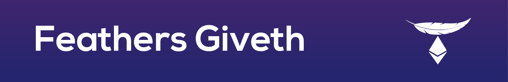

> Real-time json cache server for blockchain data

Note: Please use `develop` branch for contributing.

Welcome to the server code for Giveth's [dapp](https://github.com/Giveth/giveth-dapp). The dapp uses [feathers](http://feathersjs.com) as a cache for its blockchain transactions. By utilizing websockets on both the blockchain and client devices, we can receive and push updates simultaneously to all users in real time.

## Table of content

- [Table of content](#table-of-content)
- [Getting Started](#getting-started)
  - [Install](#install)
  - [Run server](#run-server)
  - [Kill Ganache](#kill-ganache)
  - [Video Walkthrough](#video-walkthrough)
- [Deploying](#deploying)
- [Scripts](#scripts)
- [Testing](#testing)
- [Debugging](#debugging)
- [Usage](#usage)
- [Production](#production)
- [Help](#help)

## Getting Started

### Install
1. Click **Star** on this repo near the top-right corner of this web page (if you want to).
2. Join our [slack](http://slack.giveth.io) if you haven't already.
3. Fork this repo by clicking **Fork** button in top-right corner of this web page. Continue to follow instruction steps from your own feathers-giveth repo.
5. The rest of these steps must be done from your machine's command line. Clone your own "feathers-giveth" repo. Copy the link from the "Clone or download" button near the top right of this repo's home page.
    ```
    git clone {paste your own repo link here}
    ```
6. Change directories to feathers-giveth:
    ```
    cd feathers-giveth
    ```
5. Make sure you have [NodeJS](https://nodejs.org/) (v8.4.0 or higher), [yarn](https://www.yarnpkg.com/) (v0.27.5 or higher), and npm (5.4.1 or higher) installed.
6. Install dependencies from within feathers-giveth directory:
    ```
    npm install
    ```
    * note: due to a bug in yarn, `yarn install` currently does not work

### Run server
The feathers server will need to connect to an ethereum node via websockets. Typically this will be a local TestRPC instance. 
The configuration param `blockchain.nodeUrl` is used to establish a connection. The default nodeUrl is `ws://localhost:8545`

1. We need to deploy any contract to that we intened to call. *NOTE:* The following cmd will clear the `data` dir, thus starting off in a clean state.

   ```
   yarn deploy-local
   ```

2. We provide an easy way to start the bridge & 2 ganache-cli instances.
  
    ``` 
    yarn start:networks
    ```
3. Since the bridge & ganache-cli is now running, open a new terminal window and navigate to the same feathers-giveth directory.
    
4. Start your app

    ```
    yarn start
    ```

### Kill Ganache
If you run into errors like wallet balance not loading, it is very likely that Ganache is stuck
`netstat -vanp tcp | grep 8545`
Find the process that is listening on `*.8545` and `127.0.0.1.8545` and kill it with `kill -9 PID` (which is in the last colomn)
    
### Video Walkthrough
Video tutorial walkthrough here: https://tinyurl.com/y9lx6jrl

## Deploying

1. Start a production server

    ```
    yarn serve
    ```
    
## Scripts

The `feathers-giveth/scripts` directory contains a few scripts to help development.

`deploy.js` - deploys a new vault & liquidPledging contract

`getState.js` - prints the current state of the deployed vault & liquidPledging contracts.

`confirm.js` - confirms any payments that are pending in the vault 

## Testing

Simply run `yarn test` and all your tests in the `test/` directory will be run.

## Debugging

You can control the logging level with the `LOG_LEVEL` env variable. Available levels can be found at: https://github.com/winstonjs/winston/tree/2.x#logging-levels

To enable debug logging simply start the server with `LOG_LEVEL=debug yarn start`

## Usage

Each of these services are available via rest or websockets:

```
campaigns
dacs
donations
donationsHistory
milestones
uploads
users
```
If the server is using default configurations, you can see data for any of these services through your web browser at `http://localhost:3030/SERVICE_NAME`


## Production

We use pm2 to manage our production servers. You can start the server using the `yarn serve` cmd. You will need to create an `ecosystem.config.js` file with the following contents:

```
module.exports = {
  /**
   * Application configuration section
   * http://pm2.keymetrics.io/docs/usage/application-declaration/
   */
  apps: [
    // First application
    {
      name: 'feathers',
      script: 'build/index.js',
      log_date_format: 'YYYY-MM-DD HH:mm',
      env: {
        COMMON_VARIABLE: 'true',
      },
      env_production: {
        NODE_ENV: 'production',
      },
    },
  ],
};
```

## Help

For more info on how to work with feathers checkout out their docs on [service methods](https://docs.feathersjs.com/api/databases/common.html#service-methods), [service events](https://docs.feathersjs.com/api/events.html#service-events), and [database querying](https://docs.feathersjs.com/api/databases/querying.html).

Also feel free to reach out to us on [slack](http://slack.giveth.io) for any help or to share ideas.
